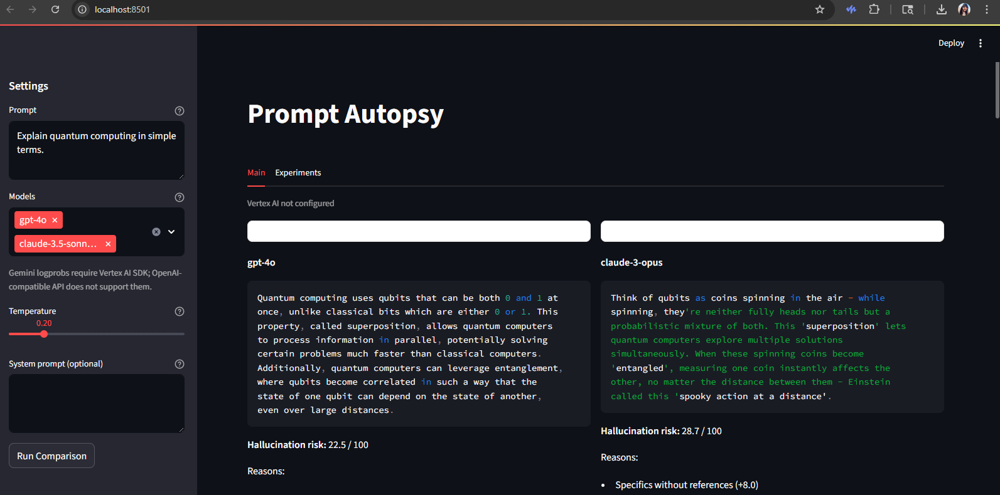
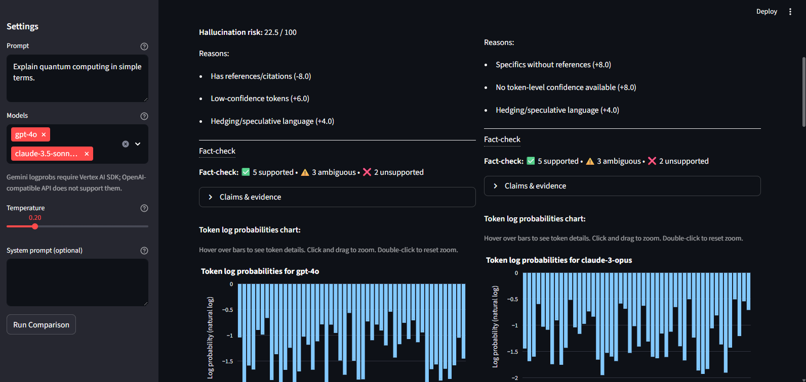
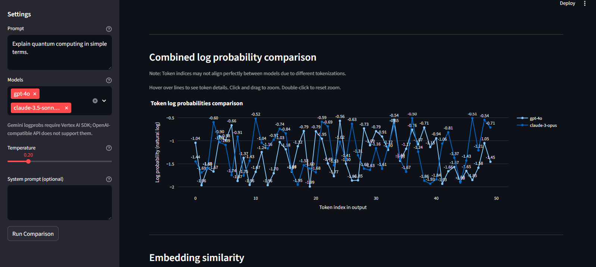
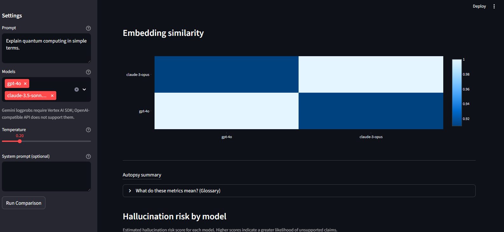
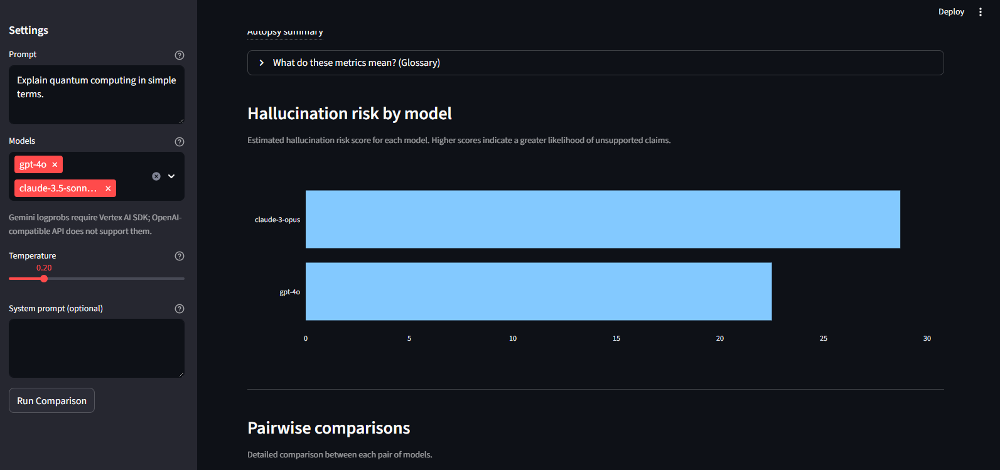
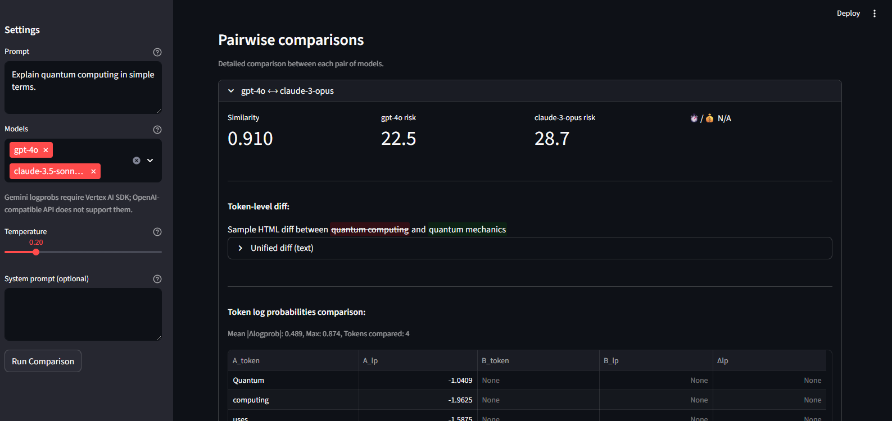
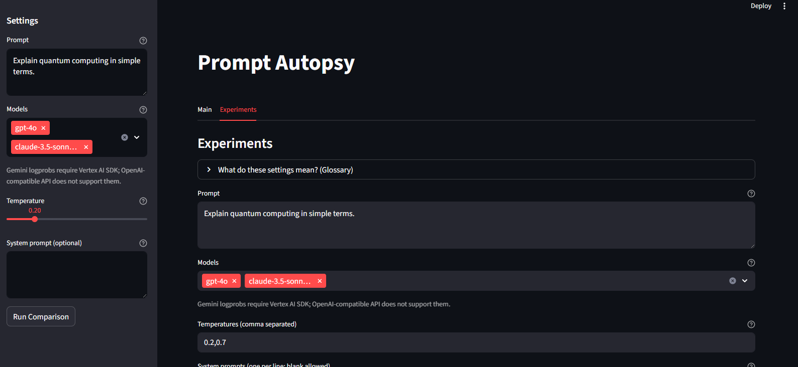
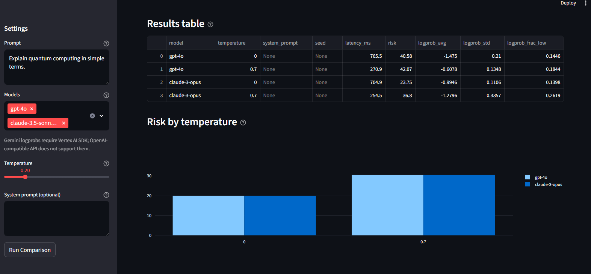
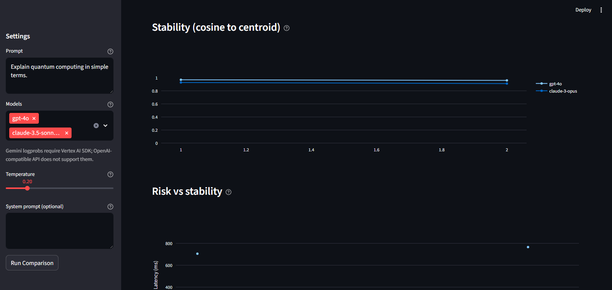

# Prompt Autopsy
[](https://github.com/Prachi-Tomar/prompt-autopsy/actions/workflows/ci.yml)
A forensic tool to compare LLM responses to the same prompt across models and explain why they differ. MVP includes:
- FastAPI endpoint /compare for multi-model calls
- Embedding-based similarity
- Token diff and placeholders for logprobs
- Logprob difference analysis between models
- Automatic detection of temperature/system prompt influence on output similarity and hallucination risk
- Streamlit UI for side-by-side viewing

## UI Overview

### Main Tab
The Main tab allows you to compare responses from different models to the same prompt. It displays:
- Side-by-side model outputs with syntax highlighting
- Hallucination risk scores and reasons
- Token log probability charts
- Embedding similarity heatmaps
- Fact-check results with claim verification
- Autopsy summary with key insights








### Experiments Tab
The Experiments tab enables you to run systematic experiments with different parameters:
- Grid-based experiment configuration
- Results table with risk, latency, and logprob metrics
- Risk by temperature charts
- Stability line charts
- Risk vs stability scatter plots
- Parameter influence analysis





## Supported Models

### Known Working Model IDs
- OpenAI: `gpt-5`, `gpt-5-mini`, `gpt-4o`, `gpt-4o-mini`
- Anthropic: `claude-3.5-sonnet-2024-10-22`, `claude-3.5-sonnet-2024-06-20`, `claude-3.5-haiku`, `claude-3-haiku`
- Google: `gemini-1.5-pro`, `gemini-1.5-flash`, `gemini-2.5-pro`, `gemini-2.5-flash`

### Model Aliasing
The tool supports model aliases for convenience and robustness to model ID changes:

| Alias | Resolves to |
|-------|------------|
| gpt-4 | gpt-4o |
| gpt4 | gpt-4o |
| gpt-4-turbo | gpt-4o |
| gpt-3.5-turbo | gpt-4o-mini |
| gpt5 | gpt-5 |
| gpt-5-turbo | gpt-5 |
| claude-3.5-sonnet-2024-10-22 | claude-3-5-sonnet-20241022 |
| claude-3.5-sonnet-2024-06-20 | claude-3-5-sonnet-20240620 |
| claude-3.5-haiku | claude-3-5-haiku-20240307 |
| claude-3-haiku | claude-3-haiku-20240307 |
| gemini-pro | gemini-1.5-pro |
| gemini-flash | gemini-1.5-flash |

### Google Gemini Support
Google Gemini models are supported through two different adapters:
- **Google API Adapter**: Uses the standard Google Generative AI API (OpenAI-compatible)
- **Vertex AI Adapter**: Uses Google Cloud Vertex AI SDK for enhanced features

The Vertex AI SDK is required for advanced features like per-token logprobs. The OpenAI-compatible API does not support per-token logprobs.
Per-token logprobs are available only via Vertex AI with `response_logprobs=True` parameter.

To use the Vertex AI adapter, you need to set the following environment variables:
- `GOOGLE_CLOUD_PROJECT`: Your Google Cloud project ID
- `VERTEX_LOCATION`: The location of your Vertex AI resources (e.g., us-central1)
- `GOOGLE_APPLICATION_CREDENTIALS`: Path to your service account JSON file

## Experiments
The Experiments feature allows you to run a grid of prompts across multiple models, temperatures, system prompts, and seeds.
It computes per-model drift and stability metrics to help you understand how different parameters affect model outputs.
- Drift: How much a model's responses vary across different parameter settings
- Stability: How consistent a model's responses are (cosine similarity to centroid)

## Quick start
1) python -m venv .venv && source .venv/bin/activate (or .venv\\Scripts\\activate on Windows)
2) pip install -r requirements.txt
3) cp .env.example .env and add your API keys
   **Note:** Prompt Autopsy does **not** ship with API keys. To run comparisons, you must provide your own keys for the LLM providers you want to use (e.g., OpenAI, Anthropic).
4) uvicorn backend.app:app --reload
5) streamlit run frontend/streamlit_app.py

## Mock Mode (no API keys required)
1) In `.env`, set `MOCK_MODE=1`
2) Start backend and frontend as usual
3) Run comparisons and experiments — all charts/tables will render with synthetic data
4) Set `MOCK_MODE=0` to go back to live APIs

## Automatic Mock Mode
If no API keys are present in the environment variables, the `/compare` endpoint will automatically return mock responses without requiring `MOCK_MODE=1`. This allows you to test the application without any API keys configured.

The mock response structure when no API keys are present:
```json
{
  "results": [
    {
      "model": "mock-model-a",
      "output": "This is a mock response for testing.",
      "similarity": 0.95,
      "logprobs": [ -0.1, -0.2, -0.3 ]
    },
    {
      "model": "mock-model-b",
      "output": "This is another mock response for testing.",
      "similarity": 0.93,
      "logprobs": [ -0.05, -0.15, -0.25 ]
    }
  ]
}
```

## Live vs Mock Mode Comparison

| Feature | Live Mode | Mock Mode |
|---------|-----------|-----------|
| LLM API Calls | Real API calls to OpenAI/Anthropic | Synthetic responses with no network calls |
| Response Content | Actual model outputs | Predefined sample responses |
| Cost | Incurs API charges | $0 |
| Speed | Network-dependent | Instant |
| Hallucination Risk Analysis | Based on real responses | Based on synthetic data |
| Embeddings | Computed from real responses | Computed from synthetic responses |
| Fact-checking | Real Wikipedia lookups (if enabled) | Predefined mock data (if enabled) |
| Token Diffs | Between real responses | Between mock responses |
| Logprob Analysis | Real model logprobs (if supported) | Synthetic logprob data |

## Notes
- Logprobs are placeholders and may depend on model support. Google's Gemini models do not currently expose token-level log probabilities through the OpenAI-compatible API. Per-token logprobs are available only via Vertex AI with response_logprobs=True.
- Embeddings computed with sentence-transformers
- Use at your own risk. MIT licensed.
- Fact-checking uses Wikipedia and simple heuristics; it's not authoritative.
- Network calls may be slow; can be disabled via FACTCHECK=0.

### Cost estimates
Costs are estimated from editable tables in `backend/analysis/pricing.py` (USD per 1K tokens). Update them to match your account's pricing. Estimates are informational only.